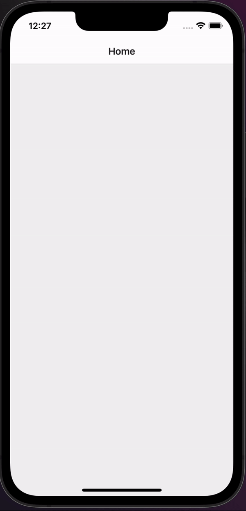

# react-native-fullscreen-animations

## Overview
react-native-fullscreen-animations is a library to provides easy to use fullscreen animations. It's based of react-native-reanimated which allows for good performance on both Android and iOS. For now, the main export is the `<Confetti />` component

If there are suggestions or ideas for improvement, please open up an issue and I'll try to get to it

## Props

| Prop Name | Prop Type | Required | Default | Description |
| ----------- | ----------- | ----------- | ----------- | ----------- |
| count | number | No | 100 | The number of pieces of confetti that  |
| colors | string[] | No | [`#a864fd`, `#29cdff`, `#78ff44`, `#ff718d`, `#fdff6a`] | An array of the colors that the confetti items will be made from. These must be hex values | 
| fallDuration | number | No | 10000 | The time in which it takes for the confetti items to fall. This value is in milliseconds | 

## To do 
- [ ] Set Confetti items to have a differing velocity
- [ ] Simulate air resistance. Slow them occasionally and move them from left to right?
- [ ] Create a publish script that automatically builds and increments the version number
- [ ] Doucment the props in the README
- [ ] Check to make sure that exports look correct
- [ ] Add tests and add the test report badge to the README
- [ ] Add to Circle CI and add the badge to the README